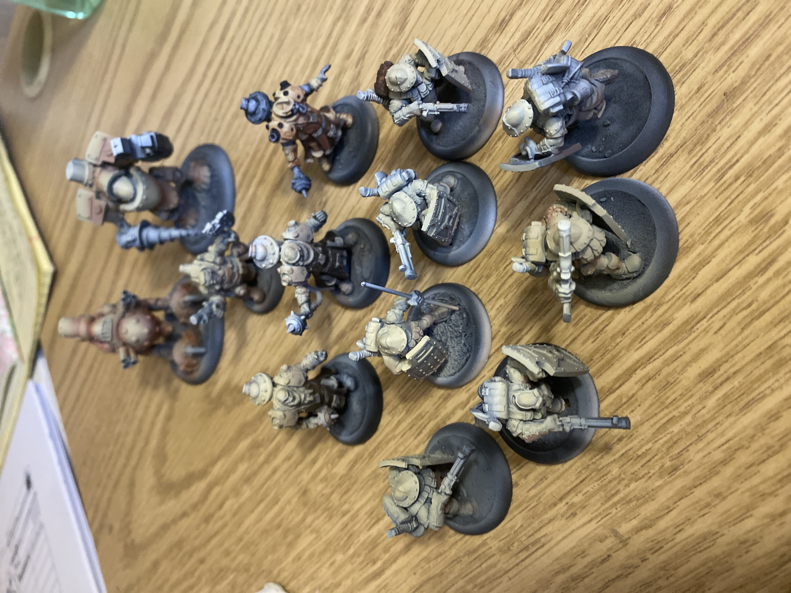
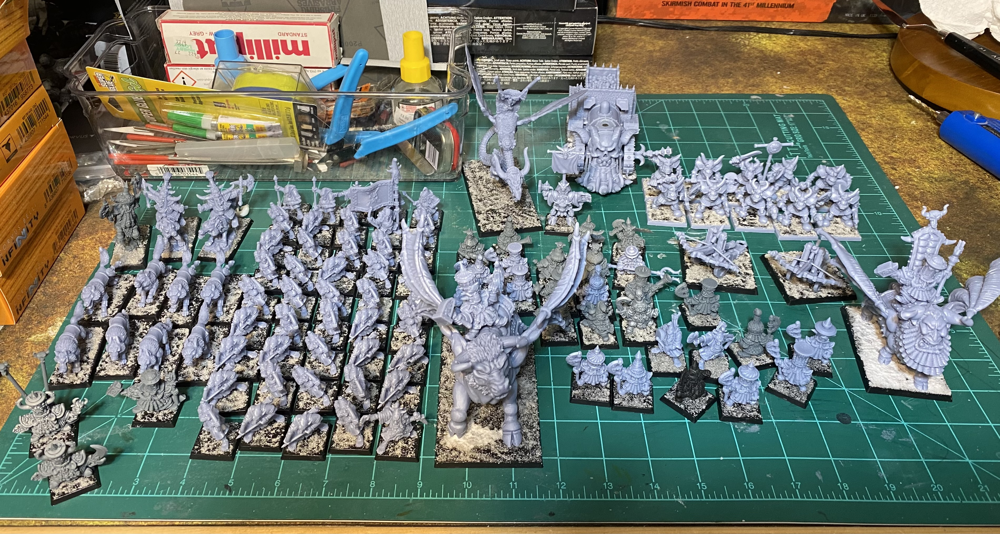
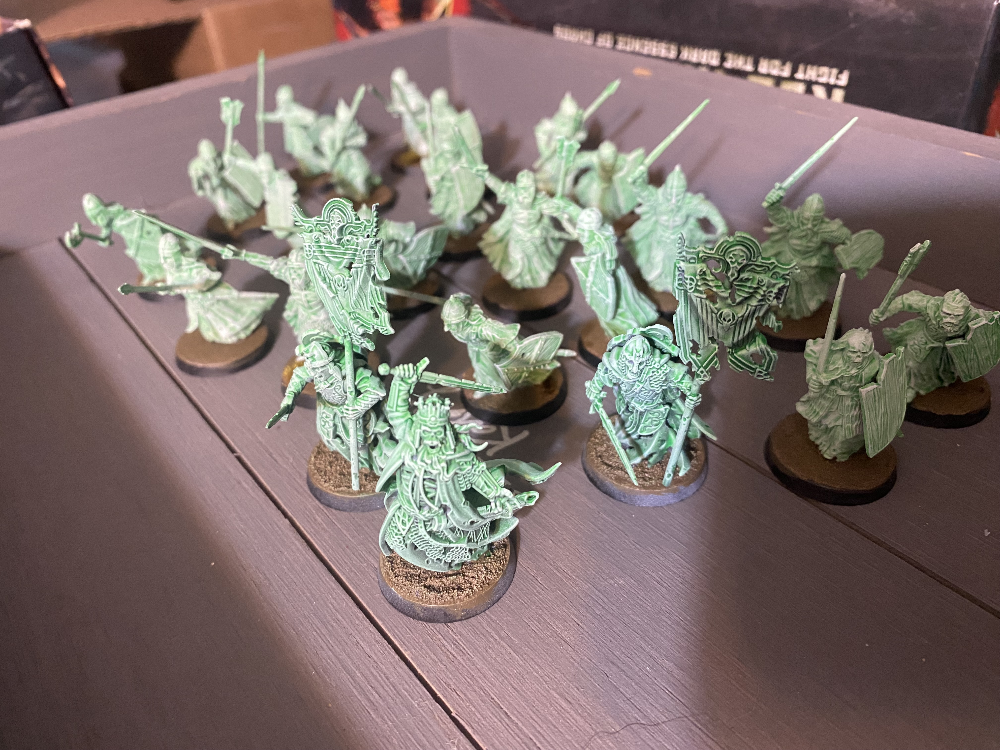

# January 2025
I've done more hobbying and painting this month than I did in the last three years. That being said I spent a good chunk of this month working on a Rhul Guard army project for Warmachine mk4, but I realized two pretty important things. I was not having fun painting them, and I probably would not be able to play Warmachine again for a good chunk of this year, why was I spending time painting this project? I shelved it and moved on. 

And by moved on, I mean I discovered infinity by corvus belli and have fallen in love. This is going to be my main competitive game goin forward. I plan on spending this next year learning the game and then in 2026 when I am able to get out and get more IRL and tournament games in I will be ready. I love this game. I have also started experimenting with battletech. I want to open up my wargaming horizons and try a ton of games this year.

I was an assembly machine this month. I put together my entire Vanilla Combined Army Lists. I printed, built, and based an entire Chaos Dwarf Army, and I nearly completed my entire Dead of Dunharrow for MESBG. I set my self to get that done done next month and hopefully paint Aragorn and Legolas to finish the entire army project. Looking back at this month and seeing how much I accomplished from just carving out 15 minutes a day for hobbying is mind blowing. This has been my most productive hobby month in literally years in terms of painting models and building them.

This month I also realized that I have so many in progress projects that I am spinning my wheels and not actually finishing things. I am going to have to bring some organization and project management into the hobby. No way around it if I want to ever actually get all this stuff done.

So I am setting myself some goals for February:
### 3d Printing
  - [ ] Old World Dwarfs
  - [ ] Halfling Bretonians
  - [ ] RPG Figures for my Crown & Skull Campaign
  - [ ] RPG Figured for my Disastrum Campaign
  - [ ] BattleTech Company Printed

### Building
- [ ] Finish building every Vanilla Combined Army Model (except Morats)
- [ ] Battletech Inner Sphere Company
- [ ] Battletech ilClan 10,000 Point List
- [ ] Ultimate Dungeon Terrain Board Finished

### Painting
- [ ] Finish Dead of Dunharrow
- [ ] Aragorn Finished
- [ ] Legolas Started
- [ ] Massive Priming session for everything I currently have built
- [ ] RPG related miniatures started

